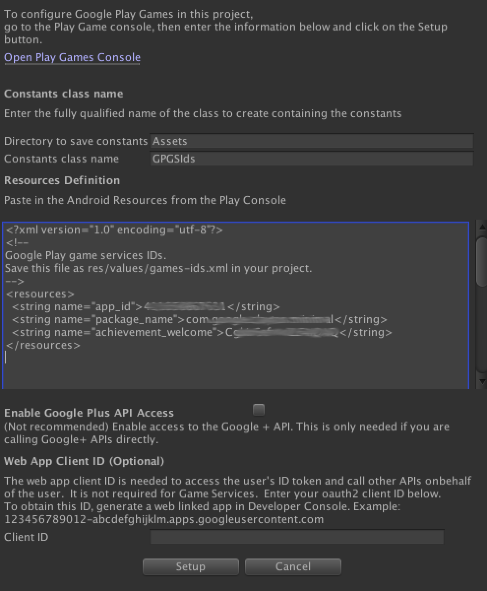

# Google Play Games plugin for Unity
_Copyright (c) 2014 Google Inc. All rights reserved._

The Google Play Games plugin for Unity&reg; is an open-source project whose goal
is to provide a plugin that allows game developers to integrate with
the Google Play Games API from a game written in Unity&reg;. However, this project is
not in any way endorsed or supervised by Unity Technologies.

_Unity&reg; is a trademark of Unity Technologies._

_iOS is a trademark of Apple, Inc._

## Overview

The Google Play Games plugin for Unity allows you to access the Google Play Games
API through Unity's [social interface](http://docs.unity3d.com/Documentation/ScriptReference/Social.html).
The plugin provides support for the
following features of the Google Play Games API:<br/>

* sign in
* friends
* unlock/reveal/increment achievement
* post score to leaderboard
* cloud save read/write
* show built-in achievement/leaderboards UI
* events
* [nearby connections](NEARBY.md)

__NOTICE__: This version of the plugin no longer supports iOS.  Google Play games services for iOS is deprecated,
and is not likely to function as expected. Do not use Google Play games
services for iOS in new apps. See the [deprecation announcement](https://android-developers.googleblog.com/2017/04/focusing-our-google-play-games-services.html) blog post for more details.

Features:

* easy GUI-oriented project setup (integrated into the Unity GUI)
* no need to override/customize the player Activity
* no need to override/customize AndroidManifest.xml

System requirements:

* Unity&reg; 2017.4 or above.

* To deploy on Android:
    * Android SDK
    * Android v4.0 or higher
    * Google Play Services library, version 11.6 or above

## Upgrading

If you have already integrated your project with a previous version of the
plugin and wish to upgrade to a new version, please refer to the
[upgrade instructions](UPGRADING.txt).

## Configure Your Game

To use the plugin, you must first [configure your
game](https://developers.google.com/games/services/console/enabling) in the
Google Play Developer Console. Follow the instructions on creating a client ID.
Be particularly careful when entering your package name and your
certificate fingerprints, since mistakes on those screens can be difficult to
recover from.

### Copy the game resources from the console

Once you configure at least one resource (event, achievement, or leaderboard),
copy the resource configuration from the Google Play Developer Console, and paste it
into the setup configuration in Unity.  To get the resources go to the Achievements
tab, then click on "Get resources" on the bottom of the list.


Then click the "Android section".


Select all the contents of the resources window, and copy them to the clipboard.

### Paste the game resources into the plugin setup dialog

Back in Unity, open the setup dialog **Window > Google Play Games > Setup... > Android Setup**



 * **Enter the directory to save constants** - Enter the folder for the constants file.
 * **Constants class name** - this is the name of the C# class to create, including namespace.
 * **Resources Definition** - paste the resource data from the Play Games console here.
 * **Web client ID** - this is the client ID of the linked web app.  It is only needed if
you have a web-based backend for your game and need a server auth code to be
exchanged for an access token by the backend server, or if you need an id token
for the player to make other, non-game, API calls.

The setup process will configure your game with the client id and generate a
C# class that contains constants for each of your resources.

## Setup Checklist

Make sure to do the following if they are relevant to your game:

1. Add tester email addresses to the testing section of your game on the Play Games Console.
2. The SHA1 fingerprint used to create the linked Android app is from the keystore
used to sign the Unity application.

## Add Achievements and Leaderboards

Add
[achievements](https://developers.google.com/games/services/common/concepts/achievements)
and
[leaderboards](https://developers.google.com/games/services/common/concepts/leaderboards)
to your game in the Google Play Developer Console. For each achievement and
leaderboard you configure, make sure to note
the corresponding **achievement ID** or **leaderboard ID**,
as those will be needed when making the API calls.
Achievement and leaderboard IDs are alphanumeric strings (e.g.  "Cgkx9eiuwi8_AQ").

## Add Events

Events allow you to track user actions in your game and report on them with
Analytics.
Read more about how to configure and use Events on
[Game Concepts - Events](https://developers.google.com/games/services/common/concepts/events)

## Load Your Game Project

Next, load your game project into the Unity editor.

If you do not have a game project to work with, you can use the **Minimal** sample
available in the **samples** directory. Using that sample will allow you to
quickly test your setup and make sure you can access the API.

If you want to test a larger sample after you are familiar with the plugin,
try the **CubicPilot** game.
More information about building the samples can be found in the
[samples README](samples/README.md) file.

## Plugin Installation

To download the plugin, clone this Git repository into your file system (or download it as
a ZIP file and unpack it). Then, look for the **unitypackage** file in
the **current-build** directory:

    current-build/GooglePlayGamesPluginForUnity-X.YY.ZZ.unitypackage

To install the plugin, simply open your game project in Unity and import that file into
your project's assets, as you would any other Unity package. This is accomplished through
the **Assets > Import Package > Custom Package** menu item (you can also reach this menu it
by right-clicking the **Assets** folder).

Next, make sure your current build platform is set to **Android**. From
**File > Build Settings…** select **Android** and click **Switch Platform**.
You should now see a new menu item was added under **Window > Google Play Games**.
If you don't see the new menu items, refresh the assets by
clicking **Assets > Refresh** and try again.

## Android Setup

Next, set up the path to your Android SDK installation in Unity. This is located in the
preferences menu, under the **External Tools** section.

To configure your Unity game to run with Google Play Games on Android, first
open the Android SDK manager and verify that you have downloaded the following
packages.  Depending on if you are using the SDK manager from Android Studio,
or using the standalone SDK manager, the name of the components may be different.
- Google Play Services
- Android Support Library
- Local Maven repository for Support Libraries (Also known as Android Support Repository)
- Google Repository
- Android 6.0 (API 23) (this does not affect the min SDK version).

Next, configure your game's package name. To do this, click **File > Build Settings**,
select the **Android** platform and click **Player Settings** to show Unity's
Player Settings window. In that window, look for the **Bundle Identifier** setting
under **Other Settings**. Enter your package name there (for example
_com.example.my.awesome.game_).

In order to sign in to Play Game Services, you need to sign your APK file,
make sure that you are signing it with the
correct certificate, that is, the one that corresponds to the SHA1 certificate
fingerprint you entered in the Developer Console during the setup.

Next, click the **Window |Google Play Games|Setup - Android setup** menu item.
This will display the Android setup screen.

Enter the Constants class name.  This is the name of the fully qualified class
that will be updated (or created) which contains the IDs of the game resources.
The format of the name is <namespace>.<classname>.  For example, `AwesomeGame.GPGSIds`

Paste the resource definition data.  This is the XML data from the Google Play Developer Console
which contains the resource IDs as well as the Application ID for Android.

This data is found in the Google Play Developer Console by clicking "Get resources" on any of the
resource pages (e.g. Achievements or Leaderboards), then clicking Android.

After pasting the data into the text area, click the **Setup** button.

**Note:**  If you are using a web application or backend server with your game,
you can link the web application to the game to enable getting the player's
id token and/or email address.  To do this, link a web application to the
game in the Google Play Developer Console, and enter the client id for
the web application into the setup dialog.

### Additional instructions on building for Android on Windows

If you are using Windows, you must make sure that your Java SDK installation
can be accessed by Unity. To do this:

1. Set the JAVA_HOME environment variable to your Java SDK installation path
(for example, `C:\Program Files\Java\jdk1.7.0_45`).
2. Add the Java SDK's `bin` folder to your `PATH` environment variable
(for example, `C:\Program Files\Java\jdk1.7.0_45\bin`)
3. Reboot.

**How to edit environment variables:** In Windows 2000/XP/Vista/7,
right-click **My Computer**, then **Properties**, then go to **Advanced System Properties**
(or **System Properties** and then click the **Advanced** tab), then
click **Environment Variables**. On Windows 8, press **Windows Key + W** and
search for **environment variables**
For more information, consult the documentation for your version of Windows.

## Run the Project

If you are working with the **Smoketest** sample, you should be able to build
and run the project at this point. You will see the automatic sign-in attempt,
when **Smoketest** starts.

To build and run on Android, click
**File > Build Settings**, select the **Android** platform, then
**Switch to Platform**, then **Build and Run**.

## ISocialPlatform Compliance

The Google Play Games plugin implements  Unity's
[social interface](http://docs.unity3d.com/Documentation/ScriptReference/Social.html),
for compatibility with games that already use that interface when integrating with other
platforms. However, some features are unique to Play Games and are
offered as extensions to the standard social interface provided by Unity.

The standard API calls can be accessed through the **Social.Active** object,
which is a reference to an **ISocialPlatform** interface. The non-standard
Google Play Games extensions can be accessed by casting the **Social.Active**
object to the **PlayGamesPlatform** class, where the additional methods are
available.

## Nearby Connections Configuration
In order to use nearby connections, a service id which uniquely identifies the
set of applications that can interact needs to be configured.
This is done by clicking the **Window > Google Play Games > Nearby Connections setup...**
menu item. This will display the
nearby connections setup screen.  On this screen enter the service ID you want to use.
It should be something that identifies your application, and  follows the
same rules as the bundle id (for example: com.example.myawesomegame.nearby).
Once you enter the id, press **Setup**.

To use nearby connections, the player does not need to be authenticated,
and no Google Play Developer Console configuration is needed.

For detailed information on nearby connection usage,
please refer to [nearby connections](NEARBY.md).

## Sign in

A connection to Game services will be automatically formed when your game is opened.
Once the connection is successful the player will be welcomed with a pop-up and
your game is ready to begin using the Games Unity Plugin.

Note: If a user has never used Google Play Games on this device, they will be
automatically taken through one-time setup operations such as creating a profile
with the Play Games app.

In the Start method of your script, listen to the result of the automatic sign-in
attempt, fetch the authentication status and disable Play Games Services features
if the user is not signed in.

```csharp
    using GooglePlayGames;

    public void Start() {
      PlayGamesPlatform.Instance.Authenticate(ProcessAuthentication);
    }

    internal void ProcessAuthentication(SignInStatus status) {
      if (status == SignInStatus.Success) {
        // Continue with Play Games Services
      } else {
        // Disable your integration with Play Games Services or show a login button
        // to ask users to sign-in. Clicking it should call
        // PlayGamesPlatform.Instance.ManuallyAuthenticate(ProcessAuthentication).
      }
    }
}
```

The result code is an enum, which gives you different failure reasons that will
help you understand sign-in failures better.

If you prefer using Unity’s Social platform, then you can alternatively use the
code block below.

```csharp
  using GooglePlayGames;

  public void Start() {
    PlayGamesPlatform.Activate();
    Social.localUser.Authenticate(ProcessAuthentication);
  }
```

Note that you cannot make any games API calls (unlock achievements, post scores,
etc) until you get a successful return value from **Authenticate**, so it is
good practice to put up a standby screen until the callback is called, to make
sure the user can't start playing the game until the authentication process
completes.

## Friends

Play Games Friends allows players to create and maintain a cross-games friends list. You can request access to this friends list to help your players play your game with their friends. See the [Friends concept page](https://developers.google.com/games/services/common/concepts/friends) for more details on the friends system.

To enable Friends, use the following functions:

*  [View friends](https://github.com/playgameservices/play-games-plugin-for-unity#view-friends): Request access to a player’s friends list, so you can add their play games friends to your in-game friends list
*  [View a player profile](https://github.com/playgameservices/play-games-plugin-for-unity#view-a-player-profile): Let a player view the Play Games profile of another player. This is essential so a player knows who their friends are, and can connect to other Play Games players in your game. This will need to be tied to a UI element to trigger the popup. See the [friends guidelines](https://developers.google.com/games/services/checklist#friends) for details.

See the [best practices guidelines](https://developers.google.com/games/services/checklist#friends) for instructions on how best to implement these APIs.

Note: To use Friends, you need to update your PGS SDK to version 20.0.0


### View friends

There are two ways to load friends, either using the `ISocial` framework or directly with `PlayGamesPlatform`.

#### Loading friends with the ISocial framework

```csharp
Social.localUser.LoadFriends((success) =>  {
    Debug.Log("Friends loaded OK: " + ok));
    foreach(IUserProfile p in Social.localUser.friends) {
         Debug.Log(p.userName + " is a friend");
    }
```

However, this call will fail if the current player has not yet granted permission to the game to access this information. Use `GetLastLoadFriendsStatus` to check if `LoadFriends` failed due to missing consent.

```csharp
 PlayGamesPlatform.Instance.GetLastLoadFriendsStatus((status) => {
    // Check for consent
    if (status == LoadFriendsStatus.ResolutionRequired) {
        // Ask for resolution.
    }
});
```

A game can ask the current player to share the friends list by calling `AskForLoadFriendsResolution`.

```csharp
PlayGamesPlatform.Instance.AskForLoadFriendsResolution((result) => {
    if (result == UIStatus.Valid) {
        // User agreed to share friends with the game. Reload friends.
    } else {
        // User doesn’t agree to share the friends list.
    }
});
```

This function will show the appropriate platform-specific friends sharing UI. This UI asks the player if they want to share their friends with the game.

#### Loading friends with PlayGamesPlatform

Another way of loading friends is to use `LoadFriends` and `LoadMoreFriends`:

```csharp
PlayGamesPlatform.Instance.LoadFriends(pageSize, forceReload, (status) => {
    // Check if the call is successful and if there are more friends to load.
});

PlayGamesPlatform.Instance.LoadMoreFriends(pageSize, (status) => {
    // Check if there are more friends to load.
});
```

The `pageSize` param represents the number of entries to request for this page. Note that if cached data already exists, the returned buffer may contain more than this size. The buffer is guaranteed to contain at least this many entries if the collection contains enough records. If `forceReload` is set to `true`, this call will clear any locally-cached data and attempt to fetch the latest data from the server. This would commonly be used for actions like a user-initiated refresh. Normally, this should be set to `false` to gain the advantages of data caching.

If the callback returns `LoadFriendsStatus.LoadMore`, then there are more friends to load. `LoadFriendsStatus.ResolutionRequired` signals that the user has not shared the friends list and you can directly call `PlayGamesPlatform.Instance.AskForLoadFriendsResolution`.

#### Determining friends list visibility

Use `PlayGamesPlatform.Instance.GetFriendsListVisibility` to check if the user has shared the friends list with the game. Possible return statuses are:

   * `FriendsListVisibilityStatus.RequestRequired` indicates you must ask for consent. 
   * `FriendsListVisibilityStatus.Visible` indicates that loading the friends list should succeed.
   * `FriendsListVisibilityStatus.Unknown` generally shouldn't happen. You can set `forceReload` to true to refresh the data.

```csharp
PlayGamesPlatform.Instance.GetFriendsListVisibility(forceReload, (friendsListVisibilityStatus) => {});
```

### View a player profile

To add or remove a player as a friend, use the show and compare profile function. This function triggers a bottom sheet dialog showing the Play Games profile of the user; call the function with the player Id of the requested player. If the player and friend have in-game nicknames, use them in the call to add more context to the profile UI:

```csharp
PlayGamesPlatform.Instance.ShowCompareProfileWithAlternativeNameHintsUI(
    mFirstFriendId, /* otherPlayerInGameName= */ null, /* currentPlayerInGameName= */ null,
    (result) => {
        // Profile comparison view has closed.
});
```

## Player Statistics

The Player Stats API let you tailor game experiences to specific segments
of players and different stages of the player lifecycle. You can build
tailored experiences for each player segment based on how players are
progressing, spending, and engaging. For example, you can use this API to
take proactive actions to encourage a less active player to re-engage with
your game, such as by displaying and promoting new in-game items when the
player signs in.

The callback takes two parameters:
1. The result code less than or equal to zero is success.
        See [CommonStatusCodes](https://developers.google.com/android/reference/com/google/android/gms/common/api/CommonStatusCodes) for all values.
2. The PlayerStats object of type GooglePlayGames.PlayGamesLocalUser.PlayerStats

For more information see [Player Stats](https://developers.google.com/games/services/android/stats).

The player stats are available after authenticating:

```csharp
    ((PlayGamesLocalUser)Social.localUser).GetStats((rc, stats) =>
        {
            // -1 means cached stats, 0 is succeess
            // see  CommonStatusCodes for all values.
            if (rc <= 0 && stats.HasDaysSinceLastPlayed()) {
                Debug.Log("It has been " + stats.DaysSinceLastPlayed + " days");
            }
        });
```

## Revealing/Unlocking an Achievement

To unlock an achievement, use the **Social.ReportProgress** method with a
progress value of 100.0f:

```csharp
    using GooglePlayGames;
    using UnityEngine.SocialPlatforms;
    ...
    // unlock achievement (achievement ID "Cfjewijawiu_QA")
    Social.ReportProgress("Cfjewijawiu_QA", 100.0f, (bool success) => {
      // handle success or failure
    });
```

Notice that according to the expected behavior of
[Social.ReportProgress](http://docs.unity3d.com/Documentation/ScriptReference/Social.ReportProgress.html),
a progress of 0.0f means revealing the achievement and a progress of 100.0f
means unlocking the achievement. Therefore, to reveal an achievement (that was
previously hidden) without unlocking it, simply call Social.ReportProgress with
a progress of 0.0f.

## Incrementing an Achievement

If your achievement is incremental, the Play Games implementation of
**Social.ReportProgress** will try to behave as closely as possible to the
expected behavior according to Unity's social API, but may not be exact. For
this reason, we recommend that you do not use Social.ReportProgress for
incremental achievements. Instead, use the
**PlayGamesPlatform.IncrementAchievement** method, which is a Play Games
extension.

```csharp
    using GooglePlayGames;
    using UnityEngine.SocialPlatforms;
    ...
    // increment achievement (achievement ID "Cfjewijawiu_QA") by 5 steps
    PlayGamesPlatform.Instance.IncrementAchievement(
        "Cfjewijawiu_QA", 5, (bool success) => {
            // handle success or failure
    });
```

## Posting a Score to a Leaderboard

To post a score to a leaderboard, call **Social.ReportScore**.

```csharp
    using GooglePlayGames;
    using UnityEngine.SocialPlatforms;
    ...
    // post score 12345 to leaderboard ID "Cfji293fjsie_QA")
    Social.ReportScore(12345, "Cfji293fjsie_QA", (bool success) => {
        // handle success or failure
    });
```

To post a score and include a metadata tag use the Play Game Services instance
directly:

```csharp
    using GooglePlayGames;
    using UnityEngine.SocialPlatforms;
    ...
    // post score 12345 to leaderboard ID "Cfji293fjsie_QA" and tag "FirstDaily")
    Social.ReportScore(12345, "Cfji293fjsie_QA", "FirstDaily", (bool success) => {
        // handle success or failure
    });
```


Note that the platform and the server will automatically discard scores that are
lower than the player's existing high score, so you can submit scores freely
without any checks to test whether or not the score is greater than the player's
existing score.

## Showing the Achievements UI

To show the built-in UI for all achievements, call
**Social.ShowAchievementsUI**.

```csharp
    using GooglePlayGames;
    using UnityEngine.SocialPlatforms;
    ...
    // show achievements UI
    Social.ShowAchievementsUI();
```

## Showing the Leaderboard UI

To show the built-in UI for all leaderboards, call **Social.ShowLeaderboardUI**.

```csharp
    using GooglePlayGames;
    using UnityEngine.SocialPlatforms;
    ...
    // show leaderboard UI
    Social.ShowLeaderboardUI();
```

If you wish to show a particular leaderboard instead of all leaderboards, you
can pass a leaderboard ID to the method. This, however, is a Play Games
extension, so the Social.Active object needs to be cast to a PlayGamesPlatform
object first:

```csharp
    using GooglePlayGames;
    using UnityEngine.SocialPlatforms;
    ...
    // show leaderboard UI
    PlayGamesPlatform.Instance.ShowLeaderboardUI("Cfji293fjsie_QA");
```

## Accessing Leaderboard data

There are 2 methods to retrieving the leaderboard score data.

### Using Social.ILeaderboard

This method uses the ILeaderboard interface to define the scope and filters
for getting the data.  This approach allows you to configure:
1. The leaderboard Id
2. The collection (social or public)
3. The timeframe (daily, weekly, all-time)
4. The rank position to start retrieving scores.
5. The number of scores (the default is 25).
6. Filter by user id.

If the from parameter is non-positive, then the results returned are
player-centered, meaning the scores around the current player's score are
returned.

```csharp
    ILeaderboard lb = PlayGamesPlatform.Instance.CreateLeaderboard();
    lb.id = "MY_LEADERBOARD_ID";
    lb.LoadScores(ok =>
        {
            if (ok) {
                LoadUsersAndDisplay(lb);
            }
            else {
                Debug.Log("Error retrieving leaderboardi");
            }
        });
```

### Using PlayGamesPlatform.LoadScores()

This method uses the PlayGamesPlatform directly.  This approach provides
additional flexibility and information when accessing the leaderboard data.

```csharp
    PlayGamesPlatform.Instance.LoadScores(
            GPGSIds.leaderboard_leaders_in_smoketesting,
            LeaderboardStart.PlayerCentered,
            100,
            LeaderboardCollection.Public,
            LeaderboardTimeSpan.AllTime,
            (data) =>
            {
                mStatus = "Leaderboard data valid: " + data.Valid;
                mStatus += "\n approx:" +data.ApproximateCount + " have " + data.Scores.Length;
            });
```

The parameters for LoadScores() are:

1. leaderboardId
2. start position (top scores or player centered)
3. row count
4. leaderboard collection (social or public)
5. time span (daily, weekly, all-time)
6. callback accepting a LeaderboardScoreData object.

The `LeaderboardScoreData` class is used to return information back to the
caller when loading scores.  The members are:
    1. Id - the leaderboard id
    2. Valid - true if the returned data is valid (the call was successful)
    3. Status - the ResponseStatus of the call
    4. ApproximateCount - the approximate number of scores in the leaderboard
    5. Title - the title of the leaderboard
    6. PlayerScore - the score of the current player
    7. Scores - the list of scores
    8. PrevPageToken - a token that can be used to call `LoadMoreScores()` to
        get the previous page of scores.
    9. NextPageToken - a token that can be used to call `LoadMoreScores()` to
        get the next page of scores.

```csharp
    void GetNextPage(LeaderboardScoreData data)
    {
        PlayGamesPlatform.Instance.LoadMoreScores(data.NextPageToken, 10,
            (results) =>
            {
                mStatus = "Leaderboard data valid: " + data.Valid;
                mStatus += "\n approx:" +data.ApproximateCount + " have " + data.Scores.Length;
            });
    }
```

This call may fail when trying to load friends with `ResponseCode.ResolutionRequired` if the user has not shared their friends list with the game. In this case, use `AskForLoadFriendsResolution` to request access.

### Getting player names

Each score has the userId of the player that made the score.  You can use
`Social.LoadUsers()` to load the player profile.  Remember that the contents
of the player profile are subject to privacy settings of the players.

```csharp
    internal void LoadUsersAndDisplay(ILeaderboard lb)
    {
        // get the user ids
        List<string> userIds = new List<string>();

        foreach(IScore score in lb.scores) {
            userIds.Add(score.userID);
        }
        // load the profiles and display (or in this case, log)
        Social.LoadUsers(userIds.ToArray(), (users) =>
            {
                string status = "Leaderboard loading: " + lb.title + " count = " +
                    lb.scores.Length;
                foreach(IScore score in lb.scores) {
                    IUserProfile user = FindUser(users, score.userID);
                    status += "\n" + score.formattedValue + " by " +
                        (string)(
                            (user != null) ? user.userName : "**unk_" + score.userID + "**");
                }
                Debug.log(status);
            });
    }
```

## Recording Events
Incrementing an event is very simple, just call the following method:

```csharp
    using GooglePlayGames;
    ...
    // Increments the event with Id "YOUR_EVENT_ID" by 1
    PlayGamesPlatform.Instance.Events.IncrementEvent("YOUR_EVENT_ID", 1);
```
This call is "fire and forget", it will handle batching and execution for you in the background.

## Saving Game State to the Cloud

For details on saved games concepts and APIs please refer to the  [documentation](https://developers.google.com/games/services/common/concepts/savedgames).

### Displaying saved games UI ###

The standard UI for selecting or creating a saved game entry is displayed by calling:

```csharp
    void ShowSelectUI() {
        uint maxNumToDisplay = 5;
        bool allowCreateNew = false;
        bool allowDelete = true;

        ISavedGameClient savedGameClient = PlayGamesPlatform.Instance.SavedGame;
        savedGameClient.ShowSelectSavedGameUI("Select saved game",
            maxNumToDisplay,
            allowCreateNew,
            allowDelete,
            OnSavedGameSelected);
    }


    public void OnSavedGameSelected (SelectUIStatus status, ISavedGameMetadata game) {
        if (status == SelectUIStatus.SavedGameSelected) {
            // handle selected game save
        } else {
            // handle cancel or error
        }
    }
```

### Opening a saved game ###

In order to read or write data to a saved game, the saved game needs to be opened. Since the saved game state is cached locally
on the device and saved to the cloud, it is possible to encounter conflicts in the state of the saved data. A conflict
happens when a device attempts to save state to the cloud but the data currently on the cloud was written by a different device.
These conflicts need to be resolved when opening the saved game data.  There are 2 open methods that handle conflict resolution,
the first **OpenWithAutomaticConflictResolution** accepts a standard resolution strategy type and automatically resolves the conflicts.
The other method, **OpenWithManualConflictResolution** accepts a callback method to allow the manual resolution of the conflict.

See __GooglePlayGames/BasicApi/SavedGame/ISavedGameClient.cs__ for more details on these methods.

```csharp
    void OpenSavedGame(string filename) {
        ISavedGameClient savedGameClient = PlayGamesPlatform.Instance.SavedGame;
        savedGameClient.OpenWithAutomaticConflictResolution(filename, DataSource.ReadCacheOrNetwork,
            ConflictResolutionStrategy.UseLongestPlaytime, OnSavedGameOpened);
    }

    public void OnSavedGameOpened(SavedGameRequestStatus status, ISavedGameMetadata game) {
        if (status == SavedGameRequestStatus.Success) {
            // handle reading or writing of saved game.
        } else {
            // handle error
        }
    }
```

### Writing a saved game ###

Once the saved game file is opened, it can be written to save the game state.  This is done by calling **CommitUpdate**.
There are four parameters to CommitUpdate:

1. the saved game metadata passed to the callback passed to one of the Open calls.
2. the updates to make to the metadata.
3. the actual byte array of data
4. a callback to call when the commit is complete.

```csharp
    void SaveGame (ISavedGameMetadata game, byte[] savedData, TimeSpan totalPlaytime) {
        ISavedGameClient savedGameClient = PlayGamesPlatform.Instance.SavedGame;

        SavedGameMetadataUpdate.Builder builder = new SavedGameMetadataUpdate.Builder();
        builder = builder
            .WithUpdatedPlayedTime(totalPlaytime)
            .WithUpdatedDescription("Saved game at " + DateTime.Now());
        if (savedImage != null) {
            // This assumes that savedImage is an instance of Texture2D
            // and that you have already called a function equivalent to
            // getScreenshot() to set savedImage
            // NOTE: see sample definition of getScreenshot() method below
            byte[] pngData = savedImage.EncodeToPNG();
            builder = builder.WithUpdatedPngCoverImage(pngData);
        }
        SavedGameMetadataUpdate updatedMetadata = builder.Build();
        savedGameClient.CommitUpdate(game, updatedMetadata, savedData, OnSavedGameWritten);
    }

    public void OnSavedGameWritten (SavedGameRequestStatus status, ISavedGameMetadata game) {
        if (status == SavedGameRequestStatus.Success) {
            // handle reading or writing of saved game.
        } else {
            // handle error
        }
    }

    public Texture2D getScreenshot() {
        // Create a 2D texture that is 1024x700 pixels from which the PNG will be
        // extracted
        Texture2D screenShot = new Texture2D(1024, 700);

        // Takes the screenshot from top left hand corner of screen and maps to top
        // left hand corner of screenShot texture
        screenShot.ReadPixels(
            new Rect(0, 0, Screen.width, (Screen.width/1024)*700), 0, 0);
        return screenShot;
    }

```

### Reading a saved game ###

Once the saved game file is opened, it can be read to load the game state.  This is done by calling **ReadBinaryData**.


```csharp
    void LoadGameData (ISavedGameMetadata game) {
        ISavedGameClient savedGameClient = PlayGamesPlatform.Instance.SavedGame;
        savedGameClient.ReadBinaryData(game, OnSavedGameDataRead);
    }

    public void OnSavedGameDataRead (SavedGameRequestStatus status, byte[] data) {
        if (status == SavedGameRequestStatus.Success) {
            // handle processing the byte array data
        } else {
            // handle error
        }
    }
```

### Deleting a saved game ###

Once the saved game file is opened, it can be deleted. This is done by calling **Delete**.


```csharp
    void DeleteGameData (string filename) {
        // Open the file to get the metadata.
        ISavedGameClient savedGameClient = PlayGamesPlatform.Instance.SavedGame;
        savedGameClient.OpenWithAutomaticConflictResolution(filename, DataSource.ReadCacheOrNetwork,
            ConflictResolutionStrategy.UseLongestPlaytime, DeleteSavedGame);
    }

    public void DeleteSavedGame(SavedGameRequestStatus status, ISavedGameMetadata game) {
        if (status == SavedGameRequestStatus.Success) {
            ISavedGameClient savedGameClient = PlayGamesPlatform.Instance.SavedGame;
            savedGameClient.Delete(game);
        } else {
            // handle error
        }
    }
```

## Retrieving server authentication codes ##
In order to access Google APIs on a backend web server on behalf of the current
player, you need to get an authentication code from the client application and
pass this to your web server application.  This code can then be exchanged for
an access token to make calls to the various APIs.
For more details on this flow see: [Google Sign-In for Websites](https://developers.google.com/identity/sign-in/web/server-side-flow).

To get the server side access code:
1. Configure the web client id of the web application linked to your game in the
Play Game Console.
2. Call `PlayGamesPlatform.Instance.RequestServerSideAccess` once the player is
  authenticated to get the server side access code.
3. Pass this code to your server application.

```csharp
  PlayGamesPlatform.Instance.RequestServerSideAccess(
    /* forceRefreshToken= */ false,
    code -> {
      // send code to server
    });
```

## Decreasing apk size

It is possible to decrease the size of the Play Games Services Unity Plugin by removing code for the Play Games Services features that your game doesn’t use by using Proguard. Proguard will remove the Play Games Unity plugin code for features that are not used in your game, so your game ships with only the code that is needed and minimizes the size impact of using Play Games Services.

Additionally, it is possible to reduce the size of the entire Unity project using Unity’s [Managed Code Stripping](https://docs.unity3d.com/Manual/ManagedCodeStripping.html), which will compress your entire project.  This can be used in conjunction with Proguard.

### Play Games Services Proguard configuration

1. Go to `File > Build Settings > Player Settings` and click `Publishing Settings` section. Choose `Proguard` for `Minify > Release`. Then, enable `User Proguard File`. If you want the plugin to be proguarded for debug apks as well, you can choose `Proguard` for `Minify > Debug`.
2. Copy the content of [the proguard configuration](scripts/proguard.txt) into `Assets/Plugins/Android/proguard-user.txt`.

## (Advanced) Using the Plugin Without Overriding the Default Social Platform

When you call `PlayGamesPlatform.Activate`, Google Play Games becomes your default social platform implementation, which means that static calls to methods in `Social` and `Social.Active` will be carried out by the Google Play Games plugin. This is the desired behavior for most games using the plugin.

However, if for some reason you wish to keep the default implementation accessible (for example, to use it to submit achievements and leaderboards to a different social platform), you can use the Google Play Games plugin without overriding the default one. To do this:

1. Do not call `PlayGamesPlatform.Activate`
2. If `Xyz` is the name of a method you wish to call on the `Social` class, do not call `Social.Xyz`. Instead, call `PlayGamesPlatform.Instance.Xyz`
3. Do not use `Social.Active` when interacting with Google Play Games. Instead, use `PlayGamesPlatform.Instance`.

That way, you can even submit scores and achievements simultaneously to two or more social platforms:

```csharp
    // Submit achievement to original default social platform
    Social.ReportProgress("MyAchievementIdHere", 100.0f, callback);

    // Submit achievement to Google Play
    PlayGamesPlatform.Instance.ReportProgress("MyGooglePlayAchievementIdHere", 100.0f, callback);
```

## Special Thanks

This section lists people who have contributed to this project by writing code, improving documentation or fixing bugs.

* [Dgizusse](https://github.com/Dgizusse) for figuring out that setting JAVA_HOME is necessary on Windows.
* [antonlicht](https://github.com/antonlicht) for fixing a bug with the parameter type of showErrorDialog on the support library.
* [pR0Ps](https://github.com/pR0Ps) for fixing an issue where OnAchievementsLoaded was not accepting an OPERATION_DEFERRED result code as a success.
* [friikyeu](https://github.com/friikyeu) for helping debug [an issue](https://github.com/playgameservices/play-games-plugin-for-unity/issues/25) that caused API calls to be queued up rather than executed even when connected.
